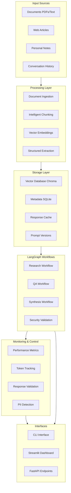
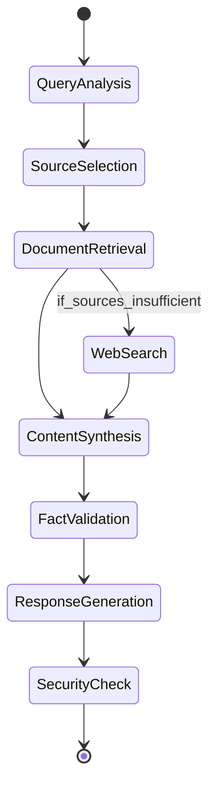

# AI Research Assistant / Second Brain System

## Project Overview

We'll build a sophisticated AI Research Assistant that serves as your second brain, capable of ingesting, analyzing, and helping you interact with your discussions, learnings, documents, and research. This system will progressively demonstrate all LangChain and LangGraph concepts while maintaining production-quality standards.

## Architecture Overview



## Core Components

### 1. Foundation Setup (`/core`)
- **Ollama Integration**: Robust connection handling with Gemma 4
- **Configuration Management**: Environment-based config with validation
- **Logging Infrastructure**: Structured logging with different levels
- **Error Handling**: Custom exceptions and recovery patterns

### 2. Schema Design (`/schemas`)
- **Pydantic Models**: Comprehensive data models for all entities
- **Research Document Schema**: Title, content, metadata, embeddings
- **Conversation Schema**: Messages, context, timestamps
- **Query Schema**: Search parameters, filters, preferences
- **Response Schema**: Structured outputs with confidence scores

### 3. Data Ingestion Pipeline (`/ingestion`)
- **Document Processors**: PDF, text, markdown, web article extractors
- **Intelligent Chunking**: Semantic chunking with overlap strategies
- **Metadata Extraction**: Automatic tagging, categorization, timestamps
- **Deduplication**: Content fingerprinting and similarity detection

### 4. Vector Storage & Retrieval (`/storage`)
- **Chroma Integration**: Vector database with metadata filtering
- **Embedding Management**: Efficient embedding generation and storage
- **Hybrid Search**: Combining semantic and keyword search
- **Conversation Memory**: Persistent conversation context

### 5. LangGraph Workflows (`/workflows`)

#### Research Workflow


#### QA Workflow with Validation
- Multi-step reasoning with source attribution
- Confidence scoring and uncertainty handling
- Fallback strategies for incomplete information

#### Synthesis Workflow
- Combining multiple sources
- Creating structured summaries
- Generating insights and connections

### 6. Security & Validation (`/security`)
- **Prompt Injection Detection**: Pattern matching and LLM-based detection
- **Input Sanitization**: Cleaning and validating user inputs  
- **PII Detection & Redaction**: Regex patterns + NER models
- **Content Safety**: Filtering inappropriate or harmful content
- **Response Validation**: Multi-layer validation with Pydantic schemas

### 7. Reliability & Control (`/reliability`)
- **Determinism Control**: Temperature management, seed control
- **Retry Mechanisms**: Exponential backoff with circuit breakers
- **Fallback Strategies**: Graceful degradation when components fail
- **Response Caching**: Intelligent caching with TTL and invalidation
- **Error Recovery**: Automatic error detection and correction attempts

### 8. Monitoring & Observability (`/monitoring`)
- **Token Usage Tracking**: Per-request and aggregate statistics
- **Performance Metrics**: Latency, throughput, error rates
- **Resource Monitoring**: CPU, memory, storage usage
- **Quality Metrics**: Response relevance, user satisfaction
- **Cost Analysis**: Detailed breakdowns and optimization suggestions

### 9. Prompt Management (`/prompts`)
- **Version Control**: Git-like versioning for prompts
- **A/B Testing**: Comparing prompt effectiveness
- **Template System**: Reusable prompt components
- **Dynamic Promts**: Context-aware prompt construction

### 10. User Interfaces (`/interfaces`)

#### Phase 1: CLI Interface
- Interactive research sessions
- Document ingestion commands
- Query and search capabilities
- Configuration management

#### Phase 2: Streamlit Dashboard
- Visual document management
- Interactive chat interface
- Analytics and metrics visualization
- Prompt testing playground

#### Phase 3: FastAPI Service
- REST endpoints for all functionality
- Authentication and rate limiting
- API documentation with OpenAPI
- Webhook integrations

## Implementation Strategy

**IMPORTANT**: This project will be implemented in stages with learning pauses between each stage. We will NOT implement everything at once. Each stage builds working, testable components that you'll explore and understand before moving forward.

## Current Session Scope: Stages 1 & 2

For this session, we'll focus on building the foundation and core workflows:

### Stage 1: Foundation (Current Session - Part 1)
**Learning Goal**: Understand LangChain basics, schema design, and local LLM integration

**Implementation Steps**:
1. Set up development environment with virtual environment
2. Install and configure core dependencies (LangChain, Ollama, Pydantic)
3. Test Ollama connection with Gemma 4
4. Create foundational Pydantic schemas for documents and queries
5. Implement basic document ingestion (text files initially)
6. Set up Chroma vector database with basic operations
7. **Pause for learning**: Test each component, understand how it works

**Deliverables**: Working document ingestion and vector storage system

### Stage 2: Core Workflows (Current Session - Part 2)
**Learning Goal**: Master LangGraph workflows and structured outputs

**Implementation Steps**:
1. Build your first simple LangGraph workflow for document Q&A
2. Implement structured output generation with Pydantic models
3. Add basic response validation and error handling
4. Create a simple CLI interface to interact with the system
5. Test with real documents and queries
6. **Pause for learning**: Experiment with different workflow patterns

**Deliverables**: Working Q&A system with CLI interface

## Future Sessions (Not Implemented Now)

### Stage 3: Advanced Features (Future Session)
- Security layers (prompt injection, PII detection)
- Retry mechanisms and fallbacks
- Monitoring and token tracking
- Prompt versioning system

### Stage 4: Production Features (Future Session)
- Streamlit dashboard
- Comprehensive error handling
- Caching and optimization
- Performance monitoring

### Stage 5: API & Integration (Future Session)
- FastAPI service
- Authentication and rate limiting
- Webhook integrations
- Final testing and documentation

## Learning Progression Philosophy

Each stage follows this pattern:
1. **Build** - Implement working components
2. **Test** - Verify functionality with examples
3. **Learn** - Understand concepts and experiment
4. **Reflect** - Discuss what worked and what didn't
5. **Ready Check** - Confirm understanding before next stage

You'll be actively involved in testing, questioning, and modifying code at each step. We'll only move to the next stage when you're comfortable with the current concepts.

## Technology Stack

### Core Dependencies
```python
# LangChain ecosystem
langchain>=0.1.0
langchain-community
langgraph>=0.0.40
langchain-ollama

# Data and validation
pydantic>=2.0
pandas
numpy

# Vector storage
chromadb
sentence-transformers

# Web and APIs
streamlit
fastapi
uvicorn

# Monitoring and observability
prometheus-client
structlog

# Security and validation
presidio-analyzer
presidio-anonymizer

# Document processing
pypdf2
beautifulsoup4
requests
```

## Key Learning Outcomes

By the end of this project, you'll have mastered:

1. **Schema Design**: Production-grade Pydantic models with validation
2. **Structured Outputs**: Reliable data extraction from LLMs
3. **Response Validation**: Multi-layer validation strategies
4. **Non-Determinism Control**: Temperature, seeds, and consistency
5. **Security**: Prompt injection defense and PII protection
6. **Prompt Versioning**: Professional prompt management
7. **Cost Tracking**: Comprehensive metrics and optimization
8. **Reliability**: Retry, fallback, and error recovery patterns
9. **LangGraph Mastery**: Complex workflow orchestration
10. **Production Deployment**: Scalable, monitored, and maintainable system

## Success Metrics

- Successfully ingest and query 100+ documents
- Handle complex multi-step research queries
- Demonstrate security resistance to injection attacks
- Achieve <2 second average response time
- 99.9% uptime with proper error handling
- Comprehensive monitoring and alerting

This project will serve as both a powerful personal tool and a comprehensive learning platform for advanced LLM application development.